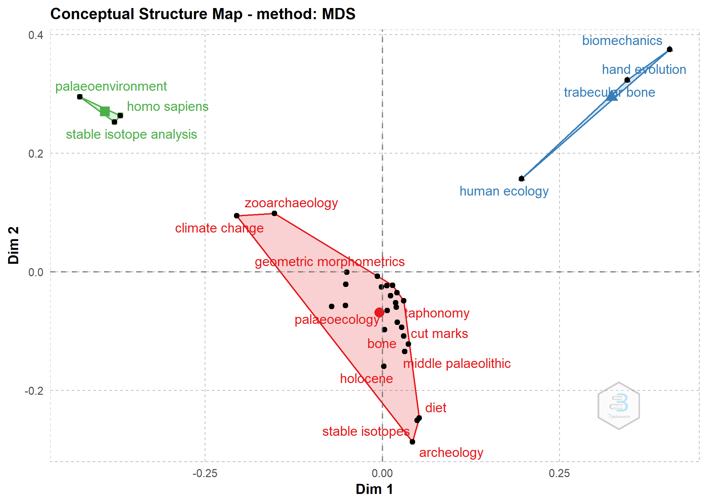

Who is using R in archaeology…and for what?
================
Robert Z. Selden, Jr.
17 May, 2021

## Bibliometrics

The dataset used in this analysis was harvested from
[Scopus](https://www.elsevier.com/solutions/scopus), includes all
articles published containing citations to R in the references AND
*archaeology* in the title, abtract, or keywords, and was analysed using
the `bibliometrix` package (Aria and Cuccurullo 2017).

``` r
# install bibliometrix and load data
# devtools::install_github("massimoaria/bibliometrix")

library(here)
```

    ## here() starts at D:/github/r-arch

``` r
library(bibliometrix)
```

    ## To cite bibliometrix in publications, please use:
    ## 
    ## Aria, M. & Cuccurullo, C. (2017) bibliometrix: An R-tool for comprehensive science mapping analysis, 
    ##                                  Journal of Informetrics, 11(4), pp 959-975, Elsevier.
    ##                         
    ## 
    ## https://www.bibliometrix.org
    ## 
    ##                         
    ## For information and bug reports:
    ##                         - Send an email to info@bibliometrix.org   
    ##                         - Write a post on https://github.com/massimoaria/bibliometrix/issues
    ##                         
    ## Help us to keep Bibliometrix free to download and use by contributing with a small donation to support our research team (https://bibliometrix.org/donate.html)
    ## 
    ##                         
    ## To start with the shiny web-interface, please digit:
    ## biblioshiny()

``` r
library(reshape2)
library(ggplot2)

df <- convert2df(file = "scopus.bib", 
                 dbsource = "scopus", 
                 format = "bibtex")
```

    ## 
    ## Converting your scopus collection into a bibliographic dataframe
    ## 
    ## Done!
    ## 
    ## 
    ## Generating affiliation field tag AU_UN from C1:  Done!

## Descriptive analysis

``` r
results <- biblioAnalysis(df, 
                          sep = ";")
options(width = 100)
s <- summary(object = results, 
             k = 20, 
             pause = FALSE)
```

    ## 
    ## 
    ## MAIN INFORMATION ABOUT DATA
    ## 
    ##  Timespan                              2008 : 2021 
    ##  Sources (Journals, Books, etc)        29 
    ##  Documents                             98 
    ##  Average years from publication        3.23 
    ##  Average citations per documents       9.163 
    ##  Average citations per year per doc    1.994 
    ##  References                            8897 
    ##  
    ## DOCUMENT TYPES                     
    ##  article           94 
    ##  book chapter      1 
    ##  editorial         1 
    ##  review            2 
    ##  
    ## DOCUMENT CONTENTS
    ##  Keywords Plus (ID)                    829 
    ##  Author's Keywords (DE)                507 
    ##  
    ## AUTHORS
    ##  Authors                               488 
    ##  Author Appearances                    510 
    ##  Authors of single-authored documents  10 
    ##  Authors of multi-authored documents   478 
    ##  
    ## AUTHORS COLLABORATION
    ##  Single-authored documents             10 
    ##  Documents per Author                  0.201 
    ##  Authors per Document                  4.98 
    ##  Co-Authors per Documents              5.2 
    ##  Collaboration Index                   5.43 
    ##  
    ## 
    ## Annual Scientific Production
    ## 
    ##  Year    Articles
    ##     2008        2
    ##     2009        1
    ##     2010        1
    ##     2011        2
    ##     2013        2
    ##     2014        2
    ##     2015        1
    ##     2016        8
    ##     2017       11
    ##     2018       27
    ##     2019       14
    ##     2020       19
    ##     2021        8
    ## 
    ## Annual Percentage Growth Rate 11.25315 
    ## 
    ## 
    ## Most Productive Authors
    ## 
    ##        Authors        Articles     Authors        Articles Fractionalized
    ## 1  CUCCHI T                  3 JERARDINO A                          1.500
    ## 2  PARGETER J                3 RODRGUEZ-RELLN C                     1.250
    ## 3  ARSUAGA JL                2 PARGETER J                           1.083
    ## 4  BONHOMME V                2 DOELLE WH                            1.000
    ## 5  CORNETTE R                2 DOYON L                              1.000
    ## 6  DOMNGUEZ-RODRIGO M        2 GREENACRE M                          1.000
    ## 7  FINKE PA                  2 HOGGARD CS                           1.000
    ## 8  HANOT P                   2 JRGENSEN EK                          1.000
    ## 9  HATALA KG                 2 MANNINEN MA                          1.000
    ## 10 HUGUET R                  2 RIRIS P                              1.000
    ## 11 JERARDINO A               2 SELDEN J                             1.000
    ## 12 KIVELL TL                 2 SCHMIDT C                            0.700
    ## 13 LAPLANA C                 2 DOMNGUEZ-RODRIGO M                   0.600
    ## 14 LEPETZ S                  2 MOCLN A                              0.600
    ## 15 MARWICK B                 2 FINKE PA                             0.583
    ## 16 MOCLN A                   2 ALLEN MS                             0.500
    ## 17 OUTRAM AK                 2 BARBIERI C                           0.500
    ## 18 RODRGUEZ-RELLN C          2 BELMAKER M                           0.500
    ## 19 SALADI P                  2 CRIF C                               0.500
    ## 20 SCHMIDT C                 2 FERNE CL                             0.500
    ## 
    ## 
    ## Top manuscripts per citations
    ## 
    ##                               Paper                                      DOI TC TCperYear   NTC
    ## 1  WILLMES M, 2018, APPL GEOCHEM             10.1016/j.apgeochem.2017.12.025 58     14.50 5.843
    ## 2  JERARDINO A, 2008, J ARCHAEOL SCI         10.1016/j.jas.2007.07.004       42      3.00 1.273
    ## 3  DOWNEY SS, 2016, PROC NATL ACAD SCI U S A 10.1073/pnas.1602504113         40      6.67 2.462
    ## 4  CREMA ER, 2017, J ARCHAEOL SCI            10.1016/j.jas.2017.09.007       34      6.80 2.968
    ## 5  REYNARD LM, 2011, J ARCHAEOL SCI          10.1016/j.jas.2010.10.017       33      3.00 1.320
    ## 6  CODDING BF, 2010, J ARCHAEOL SCI          10.1016/j.jas.2010.07.020       32      2.67 1.000
    ## 7  DIRIX K, 2013, J ARCHAEOL SCI             10.1016/j.jas.2013.02.033       29      3.22 1.706
    ## 8  GREAVES RD, 2014, J ARCHAEOL SCI          10.1016/j.jas.2013.08.014       26      3.25 1.106
    ## 9  FINKE PA, 2008, J ARCHAEOL SCI            10.1016/j.jas.2008.05.004       24      1.71 0.727
    ## 10 WILLIAMS-HATALA EM, 2018, J HUM EVOL      10.1016/j.jhevol.2018.02.008    21      5.25 2.116
    ## 11 CHARLIN J, 2014, WORLD ARCHAEOL           10.1080/00438243.2014.890914    21      2.62 0.894
    ## 12 ZANOLLI C, 2018, J HUM EVOL               10.1016/j.jhevol.2017.11.002    20      5.00 2.015
    ## 13 MARWICK B, 2016, J HUM EVOL               10.1016/j.jhevol.2016.09.004    20      3.33 1.231
    ## 14 BIBI F, 2018, J HUM EVOL                  10.1016/j.jhevol.2017.10.009    18      4.50 1.813
    ## 15 SCOTT GR, 2018, QUAT INT                  10.1016/j.quaint.2016.04.027    18      4.50 1.813
    ## 16 BONHOMME V, 2017, J ARCHAEOL SCI          10.1016/j.jas.2017.09.010       18      3.60 1.571
    ## 17 AMEEN C, 2017, J ARCHAEOL SCI             10.1016/j.jas.2017.06.014       18      3.60 1.571
    ## 18 JRGENSEN EK, 2020, QUAT INT               10.1016/j.quaint.2018.05.014    17      8.50 4.750
    ## 19 BOHDLKOV L, 2018, SCI TOTAL ENVIRON       10.1016/j.scitotenv.2018.03.142 17      4.25 1.713
    ## 20 PARGETER J, 2016, J ARCHAEOL SCI          10.1016/j.jas.2016.08.001       17      2.83 1.046
    ## 
    ## 
    ## Corresponding Author's Countries
    ## 
    ##           Country Articles   Freq SCP MCP MCP_Ratio
    ## 1  USA                  25 0.2841  12  13     0.520
    ## 2  UNITED KINGDOM       11 0.1250   5   6     0.545
    ## 3  GERMANY              10 0.1136   1   9     0.900
    ## 4  FRANCE                9 0.1023   2   7     0.778
    ## 5  SPAIN                 7 0.0795   3   4     0.571
    ## 6  BELGIUM               3 0.0341   1   2     0.667
    ## 7  AUSTRALIA             2 0.0227   2   0     0.000
    ## 8  AUSTRIA               2 0.0227   0   2     1.000
    ## 9  BRAZIL                2 0.0227   1   1     0.500
    ## 10 ITALY                 2 0.0227   1   1     0.500
    ## 11 SOUTH AFRICA          2 0.0227   1   1     0.500
    ## 12 SWITZERLAND           2 0.0227   0   2     1.000
    ## 13 ARGENTINA             1 0.0114   1   0     0.000
    ## 14 CANADA                1 0.0114   1   0     0.000
    ## 15 CHILE                 1 0.0114   0   1     1.000
    ## 16 CHINA                 1 0.0114   0   1     1.000
    ## 17 CZECH REPUBLIC        1 0.0114   1   0     0.000
    ## 18 GREECE                1 0.0114   0   1     1.000
    ## 19 IRAN                  1 0.0114   0   1     1.000
    ## 20 ISRAEL                1 0.0114   0   1     1.000
    ## 
    ## 
    ## SCP: Single Country Publications
    ## 
    ## MCP: Multiple Country Publications
    ## 
    ## 
    ## Total Citations per Country
    ## 
    ##      Country      Total Citations Average Article Citations
    ## 1  USA                        305                     12.20
    ## 2  UNITED KINGDOM             129                     11.73
    ## 3  GERMANY                     63                      6.30
    ## 4  FRANCE                      56                      6.22
    ## 5  BELGIUM                     55                     18.33
    ## 6  SOUTH AFRICA                44                     22.00
    ## 7  SPAIN                       43                      6.14
    ## 8  ARGENTINA                   21                     21.00
    ## 9  CZECH REPUBLIC              17                     17.00
    ## 10 AUSTRIA                     14                      7.00
    ## 11 NEW ZEALAND                 11                     11.00
    ## 12 CHILE                       10                     10.00
    ## 13 BRAZIL                       8                      4.00
    ## 14 CANADA                       8                      8.00
    ## 15 CHINA                        6                      6.00
    ## 16 ISRAEL                       6                      6.00
    ## 17 ITALY                        6                      3.00
    ## 18 JAPAN                        6                      6.00
    ## 19 GREECE                       5                      5.00
    ## 20 AUSTRALIA                    3                      1.50
    ## 
    ## 
    ## Most Relevant Sources
    ## 
    ##                                          Sources        Articles
    ## 1  JOURNAL OF ARCHAEOLOGICAL SCIENCE                          29
    ## 2  QUATERNARY INTERNATIONAL                                   14
    ## 3  JOURNAL OF HUMAN EVOLUTION                                 11
    ## 4  JOURNAL OF ARCHAEOLOGICAL SCIENCE: REPORTS                 10
    ## 5  QUATERNARY SCIENCE REVIEWS                                  7
    ## 6  PALAEOGEOGRAPHY PALAEOCLIMATOLOGY PALAEOECOLOGY             2
    ## 7  QUATERNARY GEOCHRONOLOGY                                    2
    ## 8  REVIEW OF PALAEOBOTANY AND PALYNOLOGY                       2
    ## 9  ADVANCES IN ARCHAEOLOGICAL PRACTICE                         1
    ## 10 ANNALS OF ANATOMY                                           1
    ## 11 APPLIED GEOCHEMISTRY                                        1
    ## 12 CATENA                                                      1
    ## 13 COMPOSITIONAL DATA ANALYSIS: THEORY AND APPLICATIONS        1
    ## 14 COMPTES RENDUS - PALEVOL                                    1
    ## 15 DENDROCHRONOLOGIA                                           1
    ## 16 GEODERMA                                                    1
    ## 17 GEODERMA REGIONAL                                           1
    ## 18 INTERNATIONAL BIODETERIORATION AND BIODEGRADATION           1
    ## 19 JOURNAL OF ANTHROPOLOGICAL ARCHAEOLOGY                      1
    ## 20 JOURNAL OF CULTURAL HERITAGE                                1
    ## 
    ## 
    ## Most Relevant Keywords
    ## 
    ##    Author Keywords (DE)      Articles  Keywords-Plus (ID)     Articles
    ## 1   ARCHAEOLOGY                     9 ARCHAEOLOGY                   72
    ## 2   ZOOARCHAEOLOGY                  7 ARCHEOLOGY                    15
    ## 3   GEOMETRIC MORPHOMETRICS         6 MORPHOMETRY                   13
    ## 4   TAPHONOMY                       6 BONE                          12
    ## 5   EXPERIMENTAL ARCHAEOLOGY        5 HOMINID                       12
    ## 6   PALEOECOLOGY                    5 HUMAN                         12
    ## 7   HOLOCENE                        4 ARCHAEOLOGICAL EVIDENCE       11
    ## 8   DIET                            3 PALEOLITHIC                   11
    ## 9   GEOARCHAEOLOGY                  3 NEOLITHIC                     10
    ## 10  LITHIC TECHNOLOGY               3 PALEOECOLOGY                   9
    ## 11  MULTIVARIATE STATISTICS         3 PLEISTOCENE                    9
    ## 12  PALAEOECOLOGY                   3 TAPHONOMY                      9
    ## 13  QUARTZ                          3 ANIMALIA                       8
    ## 14  SPATIAL ANALYSIS                3 ARTICLE                        8
    ## 15  ARCHEOLOGY                      2 EUROPE                         8
    ## 16  BIOMECHANICS                    2 HOLOCENE                       8
    ## 17  BONE                            2 HUMANS                         8
    ## 18  CLIMATE CHANGE                  2 FEMALE                         7
    ## 19  CUT MARKS                       2 FOSSIL                         7
    ## 20  DOMESTICATION                   2 HUNTER-GATHERER                7

``` r
# plot attributes
plot(x = results, 
     k = 20, 
     pause = FALSE)
```


### Attributes of the local network

``` r
# calculate citations in local network
CR <- localCitations(df, sep = ";")

# top 20 cited authors in local network
CR$Authors[1:20,]
```

    ##                 Author LocalCitations
    ## 207        JRGENSEN EK              2
    ## 13          ARAMENDI J              1
    ## 28     BARBEITO-POSE V              1
    ## 38              BIBI F              1
    ## 47        BOISSERIE JR              1
    ## 59      BUSTELO-ABUN J              1
    ## 69     CARRERO-PAZOS M              1
    ## 80             CLARK J              1
    ## 92        COURTENAY LA              1
    ## 96          CUARTERO F              1
    ## 102      DE LA TORRE I              1
    ## 136        FORTELIUS M              1
    ## 140        GABRIELA PC              1
    ## 153 GONZLEZ-AGUILERA D              1
    ## 185           HLUSKO L              1
    ## 186         HOGGARD CS              1
    ## 193          HUBLIN JJ              1
    ## 202       JEAN-LOUIS D              1
    ## 221          KIVELL TL              1
    ## 225             KLIG M              1

``` r
# top 20 cited papers in local network
CR$Papers[1:20,]
```

    ##                                        Paper                             DOI Year LCS GCS
    ## 87 DOWNEY SS, 2016, PROC NATL ACAD SCI U S A         10.1073/pnas.1602504113 2016   2  40
    ## 40           SELDEN J, 2019, J CULT HERITAGE    10.1016/j.culher.2018.07.002 2019   1   5
    ## 46             DUVAL C, 2018, J ARCHAEOL SCI       10.1016/j.jas.2018.08.016 2018   1   5
    ## 58      WILLIAMS-HATALA EM, 2018, J HUM EVOL    10.1016/j.jhevol.2018.02.008 2018   1  21
    ## 65             WILLMES M, 2018, APPL GEOCHEM 10.1016/j.apgeochem.2017.12.025 2018   1  58
    ## 71            CREMA ER, 2017, J ARCHAEOL SCI       10.1016/j.jas.2017.09.007 2017   1  34
    ## 74          BONHOMME V, 2017, J ARCHAEOL SCI       10.1016/j.jas.2017.09.010 2017   1  18
    ## 83               MARWICK B, 2016, J HUM EVOL    10.1016/j.jhevol.2016.09.004 2016   1  20
    ## 85          PARGETER J, 2016, J ARCHAEOL SCI       10.1016/j.jas.2016.08.001 2016   1  17
    ## 89           CHARLIN J, 2014, WORLD ARCHAEOL    10.1080/00438243.2014.890914 2014   1  21
    ## 98         JERARDINO A, 2008, J ARCHAEOL SCI       10.1016/j.jas.2007.07.004 2008   1  42
    ## 1    SELDEN JR. RZ, 2021, J ARCHAEOL SCI REP    10.1016/j.jasrep.2021.102916 2021   0   0
    ## 2      GABRIELA PC, 2021, J ARCHAEOL SCI REP    10.1016/j.jasrep.2021.102880 2021   0   0
    ## 3             FERNE CL, 2021, J ARCHAEOL SCI       10.1016/j.jas.2021.105346 2021   0   0
    ## 4      MACZKOWSKI A, 2021, DENDROCHRONOLOGIA    10.1016/j.dendro.2021.125811 2021   0   0
    ## 5               NAIHUI W, 2021, J PROTEOMICS     10.1016/j.jprot.2020.104078 2021   0   0
    ## 6             CARRER F, 2021, J ARCHAEOL SCI       10.1016/j.jas.2020.105306 2021   0   0
    ## 7               DENDIEVEL AM, 2021, QUAT INT    10.1016/j.quaint.2020.11.027 2021   0   0
    ## 8            PAGNOUX C, 2021, J ARCHAEOL SCI       10.1016/j.jas.2020.105263 2021   0   5
    ## 9            LIM J, 2020, J ARCHAEOL SCI REP    10.1016/j.jasrep.2020.102665 2020   0   0

``` r
# top authors' productivity over time
topAU <- authorProdOverTime(df, 
                            k = 20, 
                            graph = TRUE)
```


``` r
# number of documents published annually by top sources
topSO <- sourceGrowth(df, 
                      top = 8, 
                      cdf = TRUE)
topSO
```

    ##      Year JOURNAL OF ARCHAEOLOGICAL SCIENCE QUATERNARY INTERNATIONAL JOURNAL OF HUMAN EVOLUTION
    ## 2008 2008                                 2                        0                          0
    ## 2009 2009                                 2                        0                          0
    ## 2010 2010                                 3                        0                          0
    ## 2011 2011                                 4                        0                          0
    ## 2012 2012                                 4                        0                          0
    ## 2013 2013                                 5                        0                          0
    ## 2014 2014                                 6                        0                          0
    ## 2015 2015                                 6                        0                          0
    ## 2016 2016                                 8                        2                          1
    ## 2017 2017                                13                        5                          2
    ## 2018 2018                                20                        9                          8
    ## 2019 2019                                24                       11                          9
    ## 2020 2020                                26                       13                         11
    ## 2021 2021                                29                       14                         11
    ##      JOURNAL OF ARCHAEOLOGICAL SCIENCE: REPORTS QUATERNARY SCIENCE REVIEWS
    ## 2008                                          0                          0
    ## 2009                                          0                          0
    ## 2010                                          0                          0
    ## 2011                                          0                          0
    ## 2012                                          0                          0
    ## 2013                                          0                          0
    ## 2014                                          0                          0
    ## 2015                                          0                          0
    ## 2016                                          1                          0
    ## 2017                                          3                          0
    ## 2018                                          3                          4
    ## 2019                                          4                          6
    ## 2020                                          8                          7
    ## 2021                                         10                          7
    ##      PALAEOGEOGRAPHY, PALAEOCLIMATOLOGY, PALAEOECOLOGY QUATERNARY GEOCHRONOLOGY REVIEW OF PALAEOBOTANY AND PALYNOLOGY
    ## 2008                                                 0                        0                                     0
    ## 2009                                                 0                        0                                     0
    ## 2010                                                 0                        0                                     0
    ## 2011                                                 0                        0                                     0
    ## 2012                                                 0                        0                                     0
    ## 2013                                                 0                        1                                     0
    ## 2014                                                 0                        1                                     0
    ## 2015                                                 0                        1                                     0
    ## 2016                                                 0                        1                                     0
    ## 2017                                                 0                        1                                     0
    ## 2018                                                 0                        1                                     1
    ## 2019                                                 0                        1                                     2
    ## 2020                                                 2                        2                                     2
    ## 2021                                                 2                        2                                     2

``` r
# plot results
tso = melt(topSO, id = 'Year')
ggplot(tso, aes(Year, value, group = variable, color = variable)) + 
  geom_line()
```


## Most cited

### Most cited articles

``` r
# most cited references in global network
mcr <- citations(df, 
                 field = "article", 
                 sep = ";")
cbind(mcr$Cited[1:20])
```

    ##                                                                                                                                                                                                                                                                                                       [,1]
    ## CONTRERAS, D.A., MEADOWS, J., SUMMED RADIOCARBON CALIBRATIONS AS A POPULATION PROXY: A CRITICAL EVALUATION USING A REALISTIC SIMULATION APPROACH (2014) J. ARCHAEOL. SCI., 52, PP. 591-608                                                                                                               4
    ## R CORE TEAM, R: A LANGUAGE AND ENVIRONMENT FOR STATISTICAL COMPUTING (2015), R FOUNDATION FOR STATISTICAL COMPUTING VIENNA, AUSTRIA                                                                                                                                                                      4
    ## BRAIN, C.K., THE HUNTERS OR THE HUNTED? AN INTRODUCTION TO AFRICAN CAVE TAPHONOMY (1981), UNIVERSITY OF CHICAGO PRESS CHICAGO                                                                                                                                                                            3
    ## DE JUANA, S., GALN, A.B., DOMNGUEZ-RODRIGO, M., TAPHONOMIC IDENTIFICATION OF CUT MARKS MADE WITH LITHIC HANDAXES: AN EXPERIMENTAL STUDY (2010) J. ARCHAEOL. SCI., 37, PP. 1841-1850                                                                                                                      3
    ## DOMNGUEZ-RODRIGO, M., DE JUANA, S., GALN, A.B., RODRGUEZ, M., A NEW PROTOCOL TO DIFFERENTIATE TRAMPLING MARKS FROM BUTCHERY CUT MARKS (2009) J. ARCHAEOL. SCI., 36, PP. 2643-2654                                                                                                                        3
    ## KRUSKAL, J.B., MULTIDIMENSIONAL SCALING BY OPTIMIZING GOODNESS OF FIT TO A NONMETRIC HYPOTHESIS (1964) PSYCHOMETRIKA, 29, PP. 1-27                                                                                                                                                                       3
    ## LEAKEY, L.S., TOBIAS, P.V., NAPIER, J.R., A NEW SPECIES OF THE GENUS HOMO FROM OLDUVAI GORGE (1964) NATURE, 202, PP. 7-9                                                                                                                                                                                 3
    ## LONGIN, R., NEW METHOD OF COLLAGEN EXTRACTION FOR RADIOCARBON DATING (1971) NATURE, 230, PP. 241-242                                                                                                                                                                                                     3
    ## PARADIS, E., CLAUDE, J., STRIMMER, K., APE: ANALYSES OF PHYLOGENETICS AND EVOLUTION IN R LANGUAGE (2004) BIOINFORMATICS, 20, PP. 289-290                                                                                                                                                                 3
    ## PINEDA, A., SALADI, P., VERGS, J.M., HUGUET, R., CCERES, I., VALLVERD, J., TRAMPLING VERSUS CUT MARKS ON CHEMICALLY ALTERED SURFACES: AN EXPERIMENTAL APPROACH AND ARCHAEOLOGICAL APPLICATION AT THE BARRANC DE LA BOELLA SITE (LA CANONJA, TARRAGONA, SPAIN) (2014) J. ARCHAEOL. SCI., 50, PP. 84-93    3
    ## POTTS, R., HOMININ EVOLUTION IN SETTINGS OF STRONG ENVIRONMENTAL VARIABILITY (2013) QUAT. SCI. REV., 73, PP. 1-13                                                                                                                                                                                        3
    ## R CORE TEAM, R: A LANGUAGE AND ENVIRONMENT FOR STATISTICAL COMPUTING (2013), FOUNDATION FOR STATISTICAL COMPUTING VIENNA                                                                                                                                                                                 3
    ## R CORE TEAM, R: A LANGUAGE AND ENVIRONMENT FOR STATISTICAL COMPUTING (2017), R FOUNDATION FOR STATISTICAL COMPUTING VIENNA                                                                                                                                                                               3
    ## TIMPSON, A., COLLEDGE, S., CREMA, E., EDINBOROUGH, K., KERIG, T., MANNING, K., THOMAS, M.G., SHENNAN, S., RECONSTRUCTING REGIONAL POPULATION FLUCTUATIONS IN THE EUROPEAN NEOLITHIC USING RADIOCARBON DATES: A NEW CASE-STUDY USING AN IMPROVED METHOD (2014) J. ARCHAEOL. SCI., 52, PP. 549-557         3
    ## ADAMS, D.C., ROHLF, F.J., SLICE, D.E., A FIELD COMES OF AGE: GEOMETRIC MORPHOMETRICS IN THE 21ST CENTURY (2013) HYSTRIX, 24, PP. 7-14                                                                                                                                                                    2
    ## ALMCIJA, S., ALBA, D.M., ON MANUAL PROPORTIONS AND PAD-TO-PAD PRECISION GRASPING IN AUSTRALOPITHECUS AFARENSIS (2014) JOURNAL OF HUMAN EVOLUTION, 73, PP. 88-92                                                                                                                                          2
    ## ANDRUS, C.F.T., SHELL MIDDEN SCLEROCHRONOLOGY (2011) QUAT. SCI. REV., 30, PP. 2892-2905                                                                                                                                                                                                                  2
    ## ASSEFA, Z., YIRGA, S., REED, K.E., THE LARGE-MAMMAL FAUNA FROM THE KIBISH FORMATION (2008) J. HUM. EVOL., 55, PP. 501-512                                                                                                                                                                                2
    ## ATTENBROW, V., HISCOCK, P., DATES AND DEMOGRAPHY: ARE RADIOMETRIC DATES A ROBUST PROXY FOR LONG-TERM PREHISTORIC DEMOGRAPHIC CHANGE? (2015) ARCHAEOL. OCEAN., 50, PP. 30-36                                                                                                                              2
    ## AUERBACH, B.M., RUFF, C.B., HUMAN BODY MASS ESTIMATION: A COMPARISON OF MORPHOMETRIC AND MECHANICAL METHODS (2004) AMERICAN JOURNAL OF PHYSICAL ANTHROPOLOGY, 125, PP. 331-342                                                                                                                           2

### Most cited authors

``` r
# most cited authors in global network
mcr <- citations(df, 
                 field = "author", 
                 sep = ";")
cbind(mcr$Cited[1:20])
```

    ##                       [,1]
    ## DOMNGUEZ RODRIGO M      80
    ## ARSUAGA J L             61
    ## CARBONELL E             50
    ## HUBLIN J J              46
    ## PREZ GONZLEZ A          44
    ## YRAVEDRA J              43
    ## BAQUEDANO E             39
    ## LYCETT S J              36
    ## KIVELL T L              34
    ## SKINNER M M             31
    ## ADAMS D C               29
    ## BEHRENSMEYER A K        29
    ## MAREAN C W              29
    ## BRAUN D R               28
    ## EREN M I                28
    ## MCPHERRON S P           28
    ## SHENNAN S               28
    ## BERMDEZ DE CASTRO J M   27
    ## HUGUET R                27
    ## RUFF C B                27

### Author dominance ranking

``` r
dom <- biblioAnalysis(df)
dom.r <- dominance(dom)
dom.r
```

    ##                Author Dominance Factor Tot Articles Single-Authored Multi-Authored First-Authored Rank by Articles
    ## 1          PARGETER J              1.0            3               0              3              3                1
    ## 2            FINKE PA              1.0            2               0              2              2                2
    ## 3         JERARDINO A              1.0            2               1              1              1                2
    ## 4           MARWICK B              1.0            2               0              2              2                2
    ## 5             MOCLN A              1.0            2               0              2              2                2
    ## 6           SCHMIDT C              1.0            2               0              2              2                2
    ## 7  ALFONSO-DURRUTY MP              1.0            1               0              1              1                9
    ## 8             AMATI V              1.0            1               0              1              1                9
    ## 9          BONHOMME V              0.5            2               0              2              1                2
    ## 10            HANOT P              0.5            2               0              2              1                2
    ##    Rank by DF
    ## 1           1
    ## 2           1
    ## 3           1
    ## 4           1
    ## 5           1
    ## 6           1
    ## 7           1
    ## 8           1
    ## 9           9
    ## 10          9

## Intellectual structure

### Author co-citation

Co-citation analysis is the most commonly used bibliometric analysis
method (Ding, Chowdhury, and Foo 2001), and is defined as two
publications that are cited together in one article (Small 1973).

``` r
# extract author names from reference items
df <- metaTagExtraction(df,
                        Field = "CR_AU")

# author co-citation network
auth.co.mat <- biblioNetwork(df, 
                             analysis = "co-citation", 
                             network = "authors", 
                             sep = ";")

# network plot
auth.co.net = networkPlot(auth.co.mat, 
                          n = 50, 
                          Title = "Author Co-Citation Network", 
                          type = "auto", 
                          size = 10, 
                          size.cex = T, 
                          remove.multiple = FALSE, 
                          labelsize = 0.5, 
                          edgesize = 8, 
                          edges.min = 3, 
                          remove.isolates = TRUE)
```


``` r
# descriptive analysis of author co-citation network
auth.co.netstat <- networkStat(auth.co.mat)
summary(auth.co.netstat, k = 15)
```

    ## 
    ## 
    ## Main statistics about the network
    ## 
    ##  Size                                  4580 
    ##  Density                               0.025 
    ##  Transitivity                          0.461 
    ##  Diameter                              4 
    ##  Degree Centralization                 0.679 
    ##  Average path length                   2.157 
    ## 

### Author coupling

Coupling is a similarity measure that uses citation analysis to
illustrate a similarity relationship between documents. Author coupling
occurs when two authors reference a common third author in their
bibliographies.

``` r
# author coupling network
auth.coup.mat <- biblioNetwork(df, 
                             analysis = "coupling", 
                             network = "authors", 
                             sep = ";")

# network plot
auth.coup.net = networkPlot(auth.coup.mat, 
                          n = 50, 
                          Title = "Author Coupling Network", 
                          type = "mds", 
                          size = 10, 
                          size.cex = T,
                          remove.multiple = FALSE, 
                          labelsize = 0.5, 
                          edgesize = 10, 
                          edges.min = 8, 
                          remove.isolates = TRUE)
```


``` r
# descriptive analysis of author coupling network
auth.coup.netstat <- networkStat(auth.coup.mat)
summary(auth.coup.netstat, k = 15)
```

    ## 
    ## 
    ## Main statistics about the network
    ## 
    ##  Size                                  488 
    ##  Density                               0.122 
    ##  Transitivity                          0.542 
    ##  Diameter                              6 
    ##  Degree Centralization                 0.184 
    ##  Average path length                   2.446 
    ## 

## Historiograph direct citation linkages

The historiographic map is a chronological network map of the most
relevant direct citations resulting from this bibliographic collection.

``` r
# historical citation network
options(width = 100)
histResults <- histNetwork(df, 
                           min.citations = 5, 
                           sep = ";")
```

    ## 
    ## SCOPUS DB: Searching local citations (LCS) by document titles (TI) and DOIs...
    ## 
    ## Found 11 documents with no empty Local Citations (LCS)

``` r
# plot historical co-citation network
hnet <- histPlot(histResults, 
                 n = 100, 
                 size = 6, 
                 labelsize = 2)
```


    ## 
    ##  Legend
    ## 
    ##                                        Label                             DOI Year LCS GCS
    ## 1            SELDEN J, 2019, J CULT HERITAGE    10.1016/j.culher.2018.07.002 2019   1   5
    ## 2              DUVAL C, 2018, J ARCHAEOL SCI       10.1016/j.jas.2018.08.016 2018   1   5
    ## 3       WILLIAMS-HATALA EM, 2018, J HUM EVOL    10.1016/j.jhevol.2018.02.008 2018   1  21
    ## 4              WILLMES M, 2018, APPL GEOCHEM 10.1016/j.apgeochem.2017.12.025 2018   1  58
    ## 5             CREMA ER, 2017, J ARCHAEOL SCI       10.1016/j.jas.2017.09.007 2017   1  34
    ## 6           BONHOMME V, 2017, J ARCHAEOL SCI       10.1016/j.jas.2017.09.010 2017   1  18
    ## 7                MARWICK B, 2016, J HUM EVOL    10.1016/j.jhevol.2016.09.004 2016   1  20
    ## 8           PARGETER J, 2016, J ARCHAEOL SCI       10.1016/j.jas.2016.08.001 2016   1  17
    ## 9  DOWNEY SS, 2016, PROC NATL ACAD SCI U S A         10.1073/pnas.1602504113 2016   2  40
    ## 10           CHARLIN J, 2014, WORLD ARCHAEOL    10.1080/00438243.2014.890914 2014   1  21
    ## 11         JERARDINO A, 2008, J ARCHAEOL SCI       10.1016/j.jas.2007.07.004 2008   1  42
    ## 12   SELDEN JR. RZ, 2021, J ARCHAEOL SCI REP    10.1016/j.jasrep.2021.102916 2021   0   0
    ## 13           HARUDA AF, 2019, J ARCHAEOL SCI       10.1016/j.jas.2019.05.002 2019   0   7
    ## 14              PARGETER J, 2020, J HUM EVOL    10.1016/j.jhevol.2020.102807 2020   0   8
    ## 15         CONTRERAS D, 2018, J ARCHAEOL SCI       10.1016/j.jas.2018.02.013 2018   0   9
    ## 16             RIRIS P, 2018, J ARCHAEOL SCI       10.1016/j.jas.2018.06.008 2018   0   7
    ## 17       MARWICK B, 2020, ADV ARCHAEOL PRACT             10.1017/aap.2019.38 2020   0   0
    ## 18       PONTZER H, 2017, J ARCHAEOL SCI REP    10.1016/j.jasrep.2017.09.025 2017   0   4
    ## 19               JRGENSEN EK, 2020, QUAT INT    10.1016/j.quaint.2018.05.014 2020   0  17
    ## 20         DINAPOLI RJ, 2020, J ARCHAEOL SCI       10.1016/j.jas.2020.105094 2020   0   5
    ## 21               MORRISON AE, 2017, QUAT INT    10.1016/j.quaint.2015.09.004 2017   0  11

### ID and DE keyword associations

``` r
list <- keywordAssoc(df, 
                     sep = ";", 
                     n = 10)

list[[1]][1:10]
```

    ##          ZOOARCHAEOLOGY               TAPHONOMY GEOMETRIC MORPHOMETRICS             ARCHAEOLOGY 
    ##                       6                       6                       5                       3 
    ##                HOLOCENE MULTIVARIATE STATISTICS                  QUARTZ        SPATIAL ANALYSIS 
    ##                       3                       3                       3                       3 
    ##            PALEOECOLOGY                    DIET 
    ##                       2                       2

### Yearly occurrences of top keywords/terms

#### Authors’ keywords

``` r
topKW = KeywordGrowth(df, 
                      Tag = "DE", 
                      sep = ";", 
                      top = 10, 
                      cdf = TRUE)

topKW
```

    ##    Year ARCHAEOLOGY ZOOARCHAEOLOGY GEOMETRIC MORPHOMETRICS TAPHONOMY EXPERIMENTAL ARCHAEOLOGY
    ## 1  2008           1              1                       0         0                        0
    ## 2  2009           1              1                       0         0                        0
    ## 3  2010           1              2                       0         0                        0
    ## 4  2011           1              2                       0         0                        0
    ## 5  2012           1              2                       0         0                        0
    ## 6  2013           1              2                       0         0                        0
    ## 7  2014           1              2                       1         0                        0
    ## 8  2015           1              2                       1         0                        0
    ## 9  2016           2              2                       1         0                        0
    ## 10 2017           2              3                       2         0                        1
    ## 11 2018           4              4                       3         3                        1
    ## 12 2019           5              5                       5         4                        2
    ## 13 2020           8              6                       5         6                        5
    ## 14 2021           9              7                       6         6                        5
    ##    PALEOECOLOGY HOLOCENE DIET GEOARCHAEOLOGY LITHIC TECHNOLOGY
    ## 1             0        0    0              0                 0
    ## 2             0        0    0              0                 0
    ## 3             0        0    0              0                 0
    ## 4             0        0    1              0                 0
    ## 5             0        0    1              0                 0
    ## 6             0        0    1              1                 0
    ## 7             0        0    1              1                 0
    ## 8             0        0    1              1                 0
    ## 9             0        0    2              1                 1
    ## 10            0        1    2              2                 2
    ## 11            2        4    2              2                 2
    ## 12            2        4    2              3                 2
    ## 13            5        4    3              3                 3
    ## 14            5        4    3              3                 3

``` r
# plot results
key.plot = melt(topKW, 
                id ='Year')

ggplot(key.plot, aes(Year, 
                     value, 
                     group = variable, 
                     color = variable)) + 
  geom_line()
```


#### Publisher’s keywords

``` r
topKW = KeywordGrowth(df, 
                      Tag = "ID", 
                      sep = ";", 
                      top = 10, 
                      cdf = TRUE)

topKW
```

    ##    Year ARCHAEOLOGY ARCHEOLOGY MORPHOMETRY BONE HOMINID HUMAN ARCHAEOLOGICAL EVIDENCE PALEOLITHIC
    ## 1  2008           1          0           1    0       0     0                       1           0
    ## 2  2009           1          0           1    0       0     0                       1           0
    ## 3  2010           2          0           1    0       0     0                       1           0
    ## 4  2011           3          0           1    1       0     0                       1           0
    ## 5  2012           3          0           1    1       0     0                       1           0
    ## 6  2013           5          0           1    1       0     0                       1           0
    ## 7  2014           7          0           2    1       0     0                       1           0
    ## 8  2015           7          1           2    1       0     0                       1           0
    ## 9  2016          14          4           2    1       2     2                       2           1
    ## 10 2017          23          4           5    1       2     3                       3           3
    ## 11 2018          49         10           9    7       9     6                       6           5
    ## 12 2019          60         13          12   11      11    10                       9           7
    ## 13 2020          68         14          12   11      12    12                       9          11
    ## 14 2021          72         15          13   12      12    12                      11          11
    ##    NEOLITHIC PALEOECOLOGY
    ## 1          0            0
    ## 2          0            0
    ## 3          0            0
    ## 4          0            0
    ## 5          0            0
    ## 6          0            0
    ## 7          0            0
    ## 8          0            0
    ## 9          3            0
    ## 10         5            0
    ## 11         7            6
    ## 12         7            6
    ## 13         7            9
    ## 14        10            9

``` r
# plot results
key.plot = melt(topKW, 
                id ='Year')

ggplot(key.plot, aes(Year, 
                     value, 
                     group = variable, 
                     color = variable)) + 
  geom_line()
```


## Conceptual structure

### Co-word analysis

The co-word analysis maps the conceptual structure of a research domain
using the co-occurrence of author keywords in the bibliographic
collection.

#### Authors’ keywords

``` r
# using authors keywords
cw <- conceptualStructure(df, 
                          field = "DE", 
                          method = "MDS", 
                          minDegree = 2, 
                          clust = "auto", 
                          stemming = FALSE, 
                          labelsize = 10, 
                          documents = 50)
```



#### Publisher’s keywords

``` r
# using publishers keywords
cw <- conceptualStructure(df, 
                          field = "ID", 
                          method = "MDS", 
                          minDegree = 2, 
                          clust = "auto", 
                          stemming = FALSE, 
                          labelsize = 5, 
                          documents = 50)
```


## Thematic mapping

From (Cobo et al. 2011, 150–51):

-   Themes in the upper-right quadrant are both well developed and
    important for the structuring ofa research field. They are known as
    the motor-themes of the specialty, given that they present strong
    centrality and high density. The placement of themesin this
    quadrantimplies that theyare related externally to concepts
    applicable to otherthemesthat are conceptually closely related.
-   Themes in the upper-left quadrant have well developed internal ties
    but unimportant external ties and so are of only marginal importance
    for the field. These themes are very specialized and peripheral in
    character.
-   Themes in the lower-left quadrant are both weakly developed and
    marginal. The themes ofthis quadrant have low density and low
    centrality, mainly representing either emerging or disappearing
    themes.
-   Themes in the lower-right quadrant are important for a research
    field but are not developed. So, this quadrant groups transversal
    and general, basic themes.

### Authors’ keywords

``` r
# keyword map
map1 = thematicMap(df, 
                   field = "DE", 
                   n = 1000, 
                   minfreq = 3, 
                   stemming = FALSE, 
                   size = 0.8, 
                   n.labels = 1, 
                   repel = TRUE)

# plot map
plot(map1$map)
```


### Publisher’s keywords

``` r
# keyword map
map1 = thematicMap(df, 
                   field = "ID", 
                   n = 1000,
                   minfreq = 3, 
                   stemming = FALSE, 
                   size = 0.8, 
                   n.labels = 1, 
                   repel = TRUE)

# plot map
plot(map1$map)
```


## Social structure

### Author collaboration

Scientific collaborations are plotted where nodes are authors and links
are co-authorships, illustrating collaborations between authors.

``` r
# author collaboration network
auth.collab <- biblioNetwork(df, 
                             analysis = "collaboration", 
                             network = "authors", 
                             sep = ";")

# network plot
auth.collabnet = networkPlot(auth.collab, 
                             n = 100, 
                             Title = "Author Collaboration", 
                             type = "mds", 
                             size = 20, 
                             size.cex = T,
                             edgesize = 2, 
                             labelsize = 0.5,
                             remove.multiple = TRUE,
                             remove.isolates = TRUE)
```


``` r
# descriptive analysis of author collaboration network
auth.collab.netstat <- networkStat(auth.collab)
summary(auth.collab.netstat, k = 15)
```

    ## 
    ## 
    ## Main statistics about the network
    ## 
    ##  Size                                  488 
    ##  Density                               0.014 
    ##  Transitivity                          0.959 
    ##  Diameter                              4 
    ##  Degree Centralization                 0.031 
    ##  Average path length                   1.456 
    ## 

### Edu collaboration

Scientific collaborations are plotted where nodes are institutions and
links are co-authorships, illustrating collaborations between
institutions.

``` r
# author collaboration network
edu.collab <- biblioNetwork(df, 
                            analysis = "collaboration", 
                            network = "universities",
                            sep = ";")

# network plot
edu.collabnet = networkPlot(edu.collab, 
                            n = 100, 
                            Title = "Edu Collaboration", 
                            type = "auto", 
                            size = 30, 
                            size.cex = T, 
                            edgesize = 2, 
                            labelsize = 0.4, 
                            remove.isolates = TRUE)
```


``` r
# descriptive analysis of edu collaboration network
edu.collab.netstat<-networkStat(edu.collab)
summary(edu.collab.netstat, k = 15)
```

    ## 
    ## 
    ## Main statistics about the network
    ## 
    ##  Size                                  298 
    ##  Density                               0.019 
    ##  Transitivity                          0.752 
    ##  Diameter                              14 
    ##  Degree Centralization                 0.068 
    ##  Average path length                   4.884 
    ## 

### Country collaboration

``` r
# country collaboration network
count <- metaTagExtraction(df, 
                           Field = "AU_CO", 
                           sep = ";")

cmat1 <- biblioNetwork(count, 
                       analysis = "collaboration", 
                       network = "countries", 
                       sep = ";")

# network plot
cnet1 = networkPlot(cmat1, 
                    n = dim(cmat1)[1], 
                    Title = "Country Collaboration", 
                    type = "circle", 
                    size = 10, 
                    size.cex = T, 
                    edgesize = 1, 
                    labelsize = 0.6, 
                    cluster = "none")
```

<div class="figure">


<p class="caption">
In this figure, scientific collaborations are plotted where nodes are
countries and links are co-authorships, illustrating collaborations
between countries
</p>

</div>

``` r
# descriptive analysis of country collaboration network
countnetstat <- networkStat(cmat1)
summary(countnetstat, k = 15)
```

    ## 
    ## 
    ## Main statistics about the network
    ## 
    ##  Size                                  42 
    ##  Density                               0.207 
    ##  Transitivity                          0.487 
    ##  Diameter                              4 
    ##  Degree Centralization                 0.476 
    ##  Average path length                   1.944 
    ## 

## Colophon

This version of the analysis was generated on 2021-05-17 06:51:52 using
the following computational environment and dependencies:

``` r
# what R packages and versions were used?
if ("devtools" %in% installed.packages()) devtools::session_info()
```

    ## - Session info -----------------------------------------------------------------------------------
    ##  setting  value                       
    ##  version  R version 4.0.5 (2021-03-31)
    ##  os       Windows 10 x64              
    ##  system   x86_64, mingw32             
    ##  ui       RTerm                       
    ##  language (EN)                        
    ##  collate  English_United States.1252  
    ##  ctype    English_United States.1252  
    ##  tz       America/Chicago             
    ##  date     2021-05-17                  
    ## 
    ## - Packages ---------------------------------------------------------------------------------------
    ##  package          * version  date       lib source        
    ##  abind              1.4-5    2016-07-21 [1] CRAN (R 4.0.0)
    ##  assertthat         0.2.1    2019-03-21 [1] CRAN (R 4.0.2)
    ##  backports          1.2.1    2020-12-09 [1] CRAN (R 4.0.3)
    ##  bibliometrix     * 3.1.1    2021-05-10 [1] CRAN (R 4.0.5)
    ##  bibliometrixData   0.1.0    2020-12-10 [1] CRAN (R 4.0.3)
    ##  broom              0.7.6    2021-04-05 [1] CRAN (R 4.0.4)
    ##  cachem             1.0.4    2021-02-13 [1] CRAN (R 4.0.4)
    ##  callr              3.7.0    2021-04-20 [1] CRAN (R 4.0.4)
    ##  car                3.0-10   2020-09-29 [1] CRAN (R 4.0.3)
    ##  carData            3.0-4    2020-05-22 [1] CRAN (R 4.0.0)
    ##  cellranger         1.1.0    2016-07-27 [1] CRAN (R 4.0.2)
    ##  cli                2.5.0    2021-04-26 [1] CRAN (R 4.0.5)
    ##  cluster            2.1.1    2021-02-14 [2] CRAN (R 4.0.5)
    ##  colorspace         2.0-1    2021-05-04 [1] CRAN (R 4.0.5)
    ##  crayon             1.4.1    2021-02-08 [1] CRAN (R 4.0.3)
    ##  curl               4.3.1    2021-04-30 [1] CRAN (R 4.0.5)
    ##  data.table         1.14.0   2021-02-21 [1] CRAN (R 4.0.4)
    ##  DBI                1.1.1    2021-01-15 [1] CRAN (R 4.0.3)
    ##  dendextend         1.15.1   2021-05-08 [1] CRAN (R 4.0.5)
    ##  desc               1.3.0    2021-03-05 [1] CRAN (R 4.0.4)
    ##  devtools           2.4.1    2021-05-05 [1] CRAN (R 4.0.5)
    ##  digest             0.6.27   2020-10-24 [1] CRAN (R 4.0.3)
    ##  dimensionsR        0.0.2    2020-08-28 [1] CRAN (R 4.0.3)
    ##  dplyr              1.0.6    2021-05-05 [1] CRAN (R 4.0.5)
    ##  DT                 0.18     2021-04-14 [1] CRAN (R 4.0.4)
    ##  ellipsis           0.3.2    2021-04-29 [1] CRAN (R 4.0.5)
    ##  evaluate           0.14     2019-05-28 [1] CRAN (R 4.0.2)
    ##  factoextra         1.0.7    2020-04-01 [1] CRAN (R 4.0.3)
    ##  FactoMineR         2.4      2020-12-11 [1] CRAN (R 4.0.3)
    ##  fansi              0.4.2    2021-01-15 [1] CRAN (R 4.0.3)
    ##  farver             2.1.0    2021-02-28 [1] CRAN (R 4.0.4)
    ##  fastmap            1.1.0    2021-01-25 [1] CRAN (R 4.0.3)
    ##  flashClust         1.01-2   2012-08-21 [1] CRAN (R 4.0.3)
    ##  forcats            0.5.1    2021-01-27 [1] CRAN (R 4.0.3)
    ##  foreign            0.8-81   2020-12-22 [2] CRAN (R 4.0.5)
    ##  fs                 1.5.0    2020-07-31 [1] CRAN (R 4.0.2)
    ##  generics           0.1.0    2020-10-31 [1] CRAN (R 4.0.3)
    ##  ggnetwork          0.5.8    2020-02-12 [1] CRAN (R 4.0.5)
    ##  ggplot2          * 3.3.3    2020-12-30 [1] CRAN (R 4.0.3)
    ##  ggpubr             0.4.0    2020-06-27 [1] CRAN (R 4.0.2)
    ##  ggrepel            0.9.1    2021-01-15 [1] CRAN (R 4.0.3)
    ##  ggsignif           0.6.1    2021-02-23 [1] CRAN (R 4.0.4)
    ##  glue               1.4.2    2020-08-27 [1] CRAN (R 4.0.2)
    ##  gridExtra          2.3      2017-09-09 [1] CRAN (R 4.0.2)
    ##  gtable             0.3.0    2019-03-25 [1] CRAN (R 4.0.2)
    ##  haven              2.4.1    2021-04-23 [1] CRAN (R 4.0.5)
    ##  here             * 1.0.1    2020-12-13 [1] CRAN (R 4.0.3)
    ##  highr              0.9      2021-04-16 [1] CRAN (R 4.0.4)
    ##  hms                1.0.0    2021-01-13 [1] CRAN (R 4.0.3)
    ##  htmltools          0.5.1.1  2021-01-22 [1] CRAN (R 4.0.3)
    ##  htmlwidgets        1.5.3    2020-12-10 [1] CRAN (R 4.0.3)
    ##  httpuv             1.6.1    2021-05-07 [1] CRAN (R 4.0.5)
    ##  httr               1.4.2    2020-07-20 [1] CRAN (R 4.0.2)
    ##  igraph             1.2.6    2020-10-06 [1] CRAN (R 4.0.3)
    ##  janeaustenr        0.1.5    2017-06-10 [1] CRAN (R 4.0.5)
    ##  jsonlite           1.7.2    2020-12-09 [1] CRAN (R 4.0.3)
    ##  knitr              1.33     2021-04-24 [1] CRAN (R 4.0.5)
    ##  labeling           0.4.2    2020-10-20 [1] CRAN (R 4.0.3)
    ##  later              1.2.0    2021-04-23 [1] CRAN (R 4.0.5)
    ##  lattice            0.20-41  2020-04-02 [2] CRAN (R 4.0.5)
    ##  lazyeval           0.2.2    2019-03-15 [1] CRAN (R 4.0.2)
    ##  leaps              3.1      2020-01-16 [1] CRAN (R 4.0.3)
    ##  lifecycle          1.0.0    2021-02-15 [1] CRAN (R 4.0.4)
    ##  magrittr           2.0.1    2020-11-17 [1] CRAN (R 4.0.3)
    ##  MASS               7.3-54   2021-05-03 [1] CRAN (R 4.0.5)
    ##  Matrix             1.3-3    2021-05-04 [1] CRAN (R 4.0.5)
    ##  memoise            2.0.0    2021-01-26 [1] CRAN (R 4.0.3)
    ##  mime               0.10     2021-02-13 [1] CRAN (R 4.0.4)
    ##  munsell            0.5.0    2018-06-12 [1] CRAN (R 4.0.2)
    ##  openxlsx           4.2.3    2020-10-27 [1] CRAN (R 4.0.3)
    ##  pillar             1.6.0    2021-04-13 [1] CRAN (R 4.0.5)
    ##  pkgbuild           1.2.0    2020-12-15 [1] CRAN (R 4.0.3)
    ##  pkgconfig          2.0.3    2019-09-22 [1] CRAN (R 4.0.2)
    ##  pkgload            1.2.1    2021-04-06 [1] CRAN (R 4.0.5)
    ##  plotly             4.9.3    2021-01-10 [1] CRAN (R 4.0.3)
    ##  plyr               1.8.6    2020-03-03 [1] CRAN (R 4.0.2)
    ##  prettyunits        1.1.1    2020-01-24 [1] CRAN (R 4.0.2)
    ##  processx           3.5.2    2021-04-30 [1] CRAN (R 4.0.5)
    ##  promises           1.2.0.1  2021-02-11 [1] CRAN (R 4.0.3)
    ##  ps                 1.6.0    2021-02-28 [1] CRAN (R 4.0.4)
    ##  pubmedR            0.0.3    2020-07-09 [1] CRAN (R 4.0.3)
    ##  purrr              0.3.4    2020-04-17 [1] CRAN (R 4.0.2)
    ##  R6                 2.5.0    2020-10-28 [1] CRAN (R 4.0.3)
    ##  RColorBrewer       1.1-2    2014-12-07 [1] CRAN (R 4.0.0)
    ##  Rcpp               1.0.6    2021-01-15 [1] CRAN (R 4.0.3)
    ##  readr              1.4.0    2020-10-05 [1] CRAN (R 4.0.3)
    ##  readxl             1.3.1    2019-03-13 [1] CRAN (R 4.0.2)
    ##  remotes            2.3.0    2021-04-01 [1] CRAN (R 4.0.5)
    ##  rentrez            1.2.3    2020-11-10 [1] CRAN (R 4.0.3)
    ##  reshape2         * 1.4.4    2020-04-09 [1] CRAN (R 4.0.3)
    ##  rio                0.5.26   2021-03-01 [1] CRAN (R 4.0.4)
    ##  rlang              0.4.11   2021-04-30 [1] CRAN (R 4.0.5)
    ##  rmarkdown          2.8      2021-05-07 [1] CRAN (R 4.0.5)
    ##  rprojroot          2.0.2    2020-11-15 [1] CRAN (R 4.0.3)
    ##  rscopus            0.6.6    2019-09-17 [1] CRAN (R 4.0.3)
    ##  rstatix            0.7.0    2021-02-13 [1] CRAN (R 4.0.4)
    ##  scales             1.1.1    2020-05-11 [1] CRAN (R 4.0.2)
    ##  scatterplot3d      0.3-41   2018-03-14 [1] CRAN (R 4.0.3)
    ##  sessioninfo        1.1.1    2018-11-05 [1] CRAN (R 4.0.2)
    ##  shiny              1.6.0    2021-01-25 [1] CRAN (R 4.0.3)
    ##  SnowballC          0.7.0    2020-04-01 [1] CRAN (R 4.0.3)
    ##  stringdist         0.9.6.3  2020-10-09 [1] CRAN (R 4.0.3)
    ##  stringi            1.6.1    2021-05-10 [1] CRAN (R 4.0.5)
    ##  stringr            1.4.0    2019-02-10 [1] CRAN (R 4.0.2)
    ##  testthat           3.0.2    2021-02-14 [1] CRAN (R 4.0.4)
    ##  tibble             3.1.1    2021-04-18 [1] CRAN (R 4.0.4)
    ##  tidyr              1.1.3    2021-03-03 [1] CRAN (R 4.0.4)
    ##  tidyselect         1.1.1    2021-04-30 [1] CRAN (R 4.0.5)
    ##  tidytext           0.3.1    2021-04-10 [1] CRAN (R 4.0.5)
    ##  tokenizers         0.2.1    2018-03-29 [1] CRAN (R 4.0.5)
    ##  usethis            2.0.1    2021-02-10 [1] CRAN (R 4.0.3)
    ##  utf8               1.2.1    2021-03-12 [1] CRAN (R 4.0.4)
    ##  vctrs              0.3.8    2021-04-29 [1] CRAN (R 4.0.5)
    ##  viridis            0.6.1    2021-05-11 [1] CRAN (R 4.0.5)
    ##  viridisLite        0.4.0    2021-04-13 [1] CRAN (R 4.0.5)
    ##  withr              2.4.2    2021-04-18 [1] CRAN (R 4.0.4)
    ##  xfun               0.22     2021-03-11 [1] CRAN (R 4.0.4)
    ##  XML                3.99-0.6 2021-03-16 [1] CRAN (R 4.0.4)
    ##  xtable             1.8-4    2019-04-21 [1] CRAN (R 4.0.2)
    ##  yaml               2.2.1    2020-02-01 [1] CRAN (R 4.0.0)
    ##  zip                2.1.1    2020-08-27 [1] CRAN (R 4.0.2)
    ## 
    ## [1] C:/Users/seldenjrz/Documents/R/win-library/4.0
    ## [2] C:/Program Files/R/R-4.0.5/library

Current Git commit details are:

``` r
# where can I find this commit? 
if ("git2r" %in% installed.packages() & git2r::in_repository(path = ".")) git2r::repository(here::here())  
```

    ## Local:    main D:/github/r-arch
    ## Remote:   main @ origin (https://github.com/aksel-blaise/r-arch)
    ## Head:     [01e5674] 2021-05-17: Initial commit

## References cited

<div id="refs" class="references csl-bib-body hanging-indent">

<div id="ref-RN20997" class="csl-entry">

Aria, Massimo, and Corrado Cuccurullo. 2017. “Bibliometrix : An r-Tool
for Comprehensive Science Mapping Analysis.” *Journal of Informetrics*
11 (4): 959–75. <https://doi.org/10.1016/j.joi.2017.08.007>.

</div>

<div id="ref-RN20996" class="csl-entry">

Cobo, M. J., A. G. López-Herrera, E. Herrera-Viedma, and F. Herrera.
2011. “An Approach for Detecting, Quantifying, and Visualizing the
Evolution of a Research Field: A Practical Application to the Fuzzy Sets
Theory Field.” Journal Article. *Journal of Informetrics* 5 (1): 146–66.
<https://doi.org/10.1016/j.joi.2010.10.002>.

</div>

<div id="ref-RN20999" class="csl-entry">

Ding, Ying, Gobinda G. Chowdhury, and Schubert Foo. 2001. “Bibliometric
Cartography of Information Retrieval Research by Using Co-Word
Analysis.” *Information Processing & Management* 37 (6): 817–42.
<https://doi.org/10.1016/s0306-4573(00)00051-0>.

</div>

<div id="ref-RN21000" class="csl-entry">

Small, Henry. 1973. “Co-Citation in the Scientific Literature: A New
Measure of the Relationship Between Two Documents.” *Journal of the
American Society for Information Science* 24 (4): 265–69.
<https://doi.org/10.1002/asi.4630240406>.

</div>

</div>
